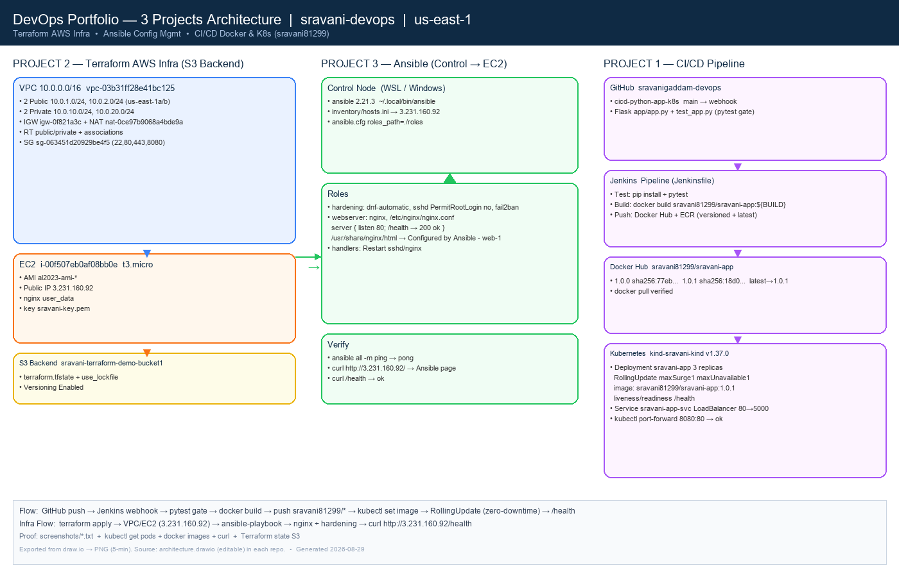

# Configuration Management with Ansible


Configures EC2 instances provisioned by Terraform (3.231.160.92).

## Architecture

*Editable: `architecture.drawio` → app.diagrams.net*

## Proof
```
screenshots/ansible-ping.txt          # web-1 | SUCCESS => pong
screenshots/ansible-playbook.txt      # PLAY RECAP ok=12 changed=2 failed=0
screenshots/curl-ec2.txt              # <h1>Configured by Ansible - web-1</h1>
screenshots/curl-ec2-health.txt       # ok
screenshots/architecture.png
```
Browser screenshot: `http://3.231.160.92/` shows Ansible page (Not secure = http, expected).

## Structure
- `ansible.cfg` — defaults (roles_path=./roles)
- `inventory/hosts.ini` — `ansible_host=3.231.160.92 ansible_user=ec2-user ansible_ssh_private_key_file=~/.ssh/sravani-key.pem`
- `playbooks/site.yml` — hardening + webserver
- `roles/hardening` — sshd, dnf-automatic, firewalld
- `roles/webserver` — nginx `/health` 200 ok

## Usage
```bash
ansible all -m ping -i inventory/hosts.ini
ansible-playbook playbooks/site.yml -i inventory/hosts.ini --check --diff
ANSIBLE_ROLES_PATH=./roles ansible-playbook playbooks/site.yml -i inventory/hosts.ini
curl http://3.231.160.92/health
```

## .gitignore
Python/Node + Ansible: no `*.retry`, `.vault_pass`, `node_modules/`, `.env`, `*.pem`, `*.key`
